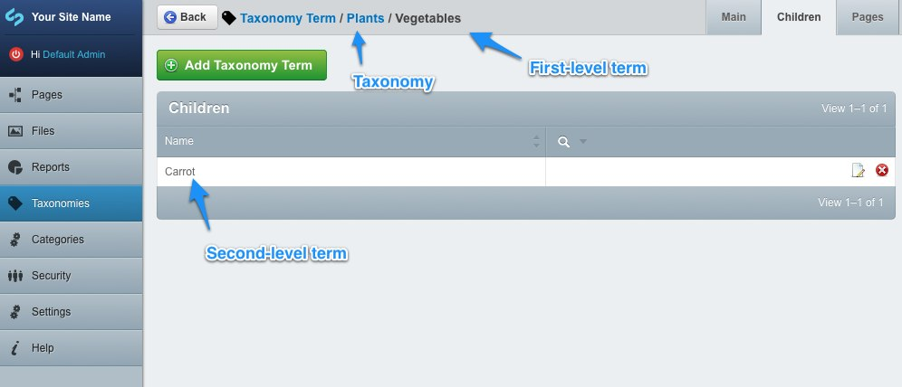

# Taxonomy usage

This module provides a raw skeleton for maintaining taxonomies in the CMS. The interface for linking between the other
objects in the CMS and the taxonomy terms can be provided in a programmatic manner depending on the requirements. This
could for example be accomplished through the usage of the `GridField` in the CMS.

## Taxonomy creation

The taxonomies are maintained through the *Taxonomies* section of the CMS.

The top-level element of the taxonomy is the equivalent of the taxonomy itself - it serves to provide it's name, and as
a holder of all the taxonomy's terms. Terms can be infinitely nested, and any term can have multiple child terms.

To create a taxonomy, go to the *Taxonomies* section. The list that appears contains all existing taxonomies - there
could be many in parallel. Click *Add taxonomy term* (remember, the top level term is equivalent of the taxonomy),
specify the name (e.g. "Plants") and press *Save*. You have just created a taxonomy.

To create first layer of terms within the taxonomy, switch to the *Children* tab. Press the green *Add* button again,
and this time create "Vegetables". Switch to *Children* tab, and nest another term underneath: "Carrot". You have just
created a three-level hierarchy of "Plants > Vegetables > Carrot".

You can easily navigate around the hierarchy by using breadcrumbs at the top as you would with any `GridField` in
SilverStripe CMS. Click on "Vegetables", and you will be able to add more first-level children.

## Taxonomy removal

The taxonomies can be recursively removed. To remove entire taxonomy, you can click the red "X" next to one of the items
listed in the *Taxonomies* section. All terms belonging to it will be removed.

You can also remove parts of the taxonomy tree - just descend into the children terms, and clikck the red "X" next to
the top-level item of the subtree to be removed.

## Permissions

Site administrator can specify permissions around taxonomies. There are three new permissions that can be set on groups:

* *Edit a taxonomy term*: allows members of the group to update the taxonomy details (e.g. *Name*).
* *Delete a taxonomy term and all nested terms*: allows to delete items recursively.
* *Create a taxonomy term*: allows adding new terms to existing taxonomies.
